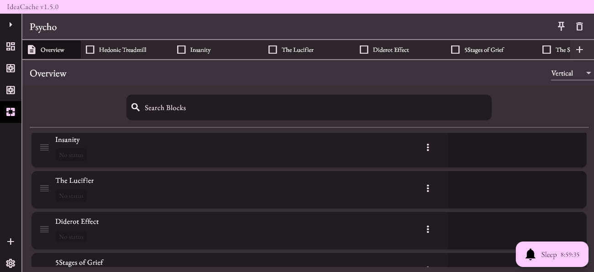
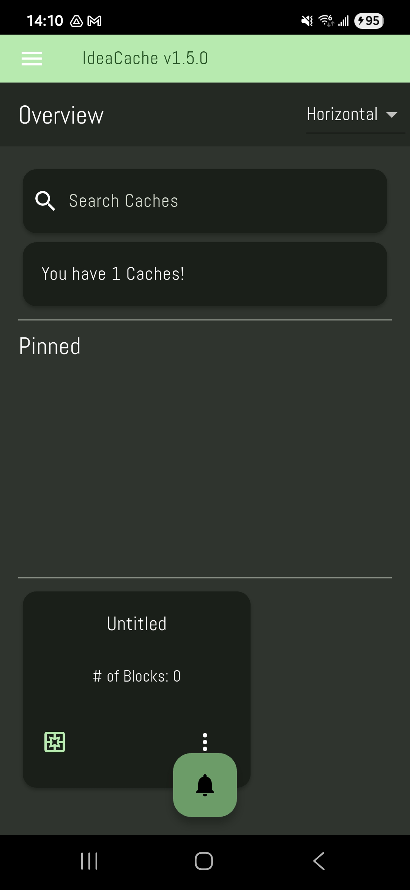

# IdeaCache

**IdeaCache** is a minimal, fast, and intuitive note-taking app designed to capture the chaos of your ideas effortlessly. Built for Windows, it helps you jot down thoughts, and keep your mind clean without the clutter of complex tools.

## Features
- **Lightweight and Fast**: Quickly capture ideas with a clean, distraction-free interface.
- **Rich Text Editing**: Powered by `flutter_quill`, supports formatting like bold, italics, lists, and more.
- **Local Storage**: Notes are securely saved on your device for offline access.
- **Simple Organization**: Easily manage and categorize your notes.

## Supported Platforms
Available for **Windows** and **Android**

### System Requirements
- Windows 10 or later
- Android Version API 33+

## Installation
1. Visit the [Releases page](https://github.com/undefinedpatient/idea_cache/releases) on GitHub.
2. Download the latest `.exe` or `.apk` installer generated using Inno Setup Compiler.
3. Run the installer and follow the on-screen instructions to install IdeaCache like any other Windows application.

## Where Notes Are Stored
For Windows, IdeaCache saves your documents and data locally in the following directory: %HOME%/Documents

## License
[MIT License](https://choosealicense.com/licenses/mit/)

